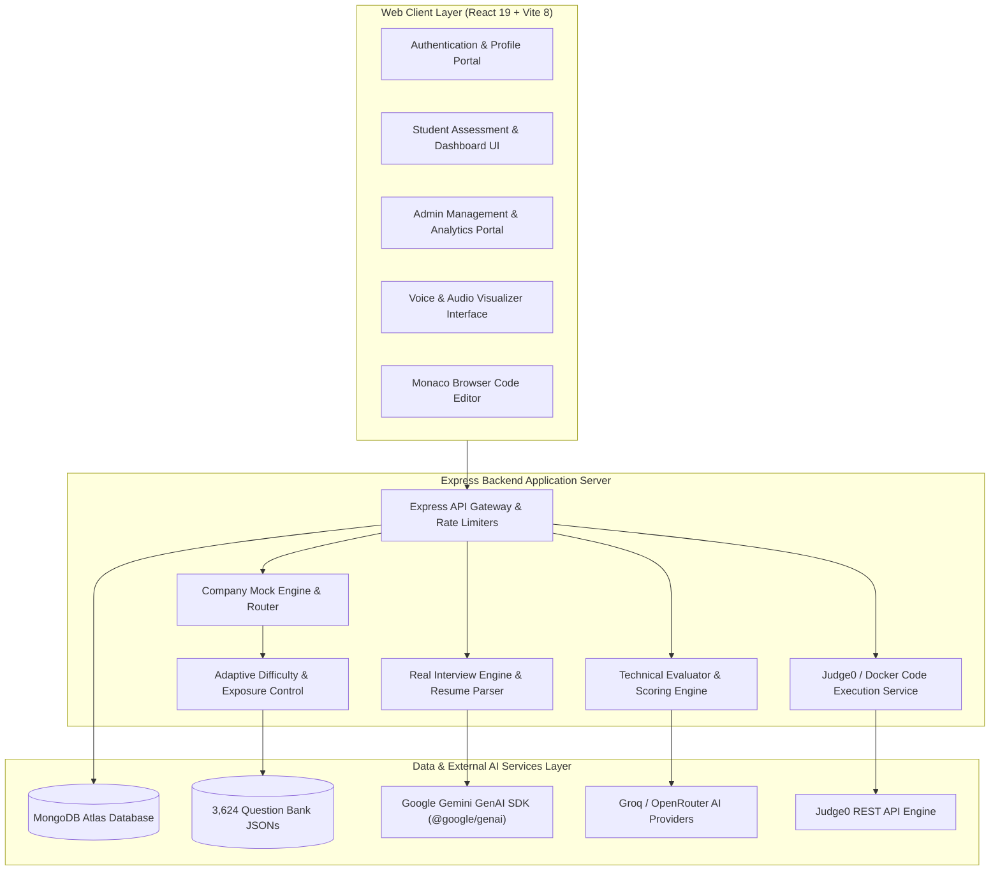
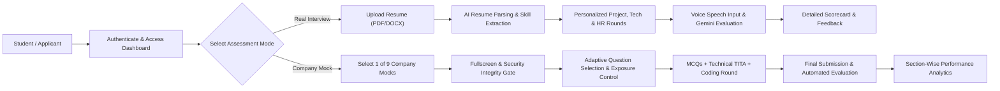
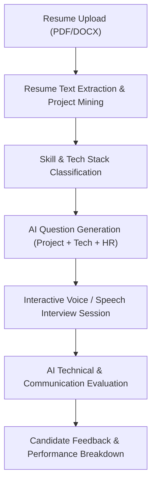
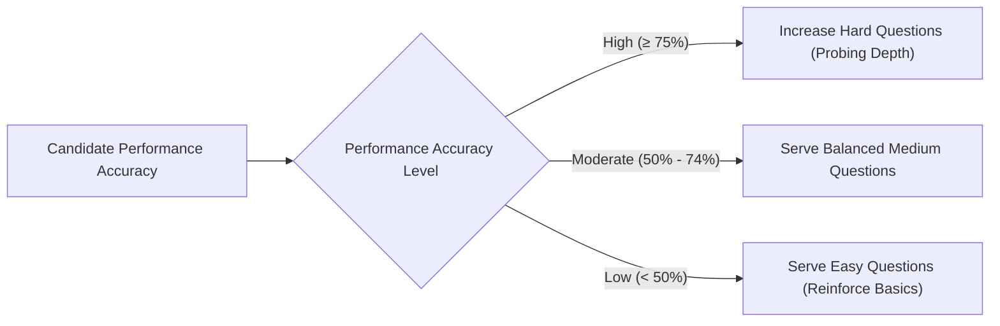
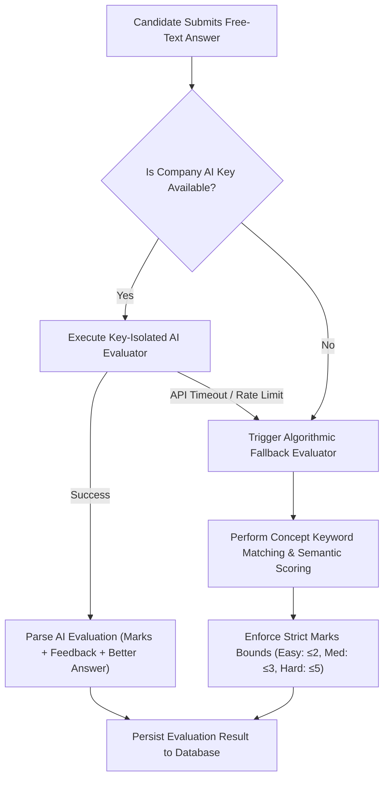

<p align="center">
  
</p>

<h1 align="center">AI Interview Platform</h1>

<p align="center">
  <b>A Production-Grade, Dual-Engine AI Platform for Technical Interview Simulation & Company-Specific Mock Hiring Assessments</b>
</p>

<p align="center">
  
  
  
  
  
  
  
  
</p>

---

## 📋 Table of Contents

- [Project Overview](#-project-overview)
- [Problem Statement & Solution](#-problem-statement--solution)
- [High-Level Platform Architecture](#-high-level-platform-architecture)
- [End-to-End System Workflow](#-end-to-end-system-workflow)
- [Real Interview Engine](#-real-interview-engine)
- [Company Mock Assessment Engine](#-company-mock-assessment-engine)
- [Supported Company Hiring Tracks](#-supported-company-hiring-tracks)
- [Assessment Question Formats](#-assessment-question-formats)
- [Adaptive Difficulty Mechanism](#-adaptive-difficulty-mechanism)
- [Zero-Repeat Exposure System](#-zero-repeat-exposure-system)
- [AI Technical Evaluation & Fallback Pipeline](#-ai-technical-evaluation--fallback-pipeline)
- [Company AI Key Isolation Architecture](#-company-ai-key-isolation-architecture)
- [Coding Assessment & Execution Engine](#-coding-assessment--execution-engine)
- [Assessment Timer & Attempt Persistence](#-assessment-timer--attempt-persistence)
- [Assessment Security & Integrity](#-assessment-security--integrity)
- [Submission, Scoring & Detailed Analytics](#-submission-scoring--detailed-analytics)
- [Real Interview vs. Company Mock Comparison](#-real-interview-vs-company-mock-comparison)
- [Student & Admin Portals](#-student--admin-portals)
- [Technology Stack](#-technology-stack)
- [Getting Started & Installation](#-getting-started--installation)
- [Environment Variable Configuration](#-environment-variable-configuration)
- [API Capability Overview](#-api-capability-overview)
- [Testing & Quality Assurance](#-testing--quality-assurance)
- [Project Highlights & Future Scope](#-project-highlights--future-scope)

---

## 🚀 Project Overview

**AI Interview Platform** is a full-stack, production-grade Web platform engineered to solve the challenges of technical interview preparation and standardized mock hiring assessments. The platform combines conversational AI engines, automated code compilation environments, adaptive difficulty algorithms, and security anti-cheat controls to deliver realistic, high-fidelity assessment experiences for students, job applicants, and recruiters.

The platform provides two completely distinct interview experiences:
1. **Real Interview Engine**: A personalized, dynamic AI voice/speech interview simulator that parses candidate resumes (PDF/DOCX), extracts candidate skills and project experience, generates tailored interview rounds (Project, Technical, HR), and evaluates candidate verbal responses using Google Gemini GenAI models.
2. **Company Mock Assessment Engine**: A standardized hiring assessment pipeline supporting **9 major corporate recruitment tracks** (Celebal Technologies, TCS, Wipro, Accenture, Benchmark IT Solutions, Capgemini, Cognizant, Deloitte, Infosys). It evaluates candidates across MCQs, TITA (Type-In-The-Answer) technical questions, and interactive coding challenges with automated test-case evaluation.

---

## 🎯 Problem Statement & Solution

### The Challenge
- **Lack of Realistic Practice**: Job seekers often lack access to simulated technical interviews that mimic real candidate-interviewer dynamics or company-specific Online Assessments (OAs).
- **Generic Questioning**: Traditional platforms use fixed question banks that fail to probe a candidate's actual projects or resume-declared technical skills.
- **Inconsistent Evaluation**: Human mock interview feedback is often subjective, non-standardized, and delayed.
- **Lack of Integrated Coding & Theory**: Most preparation platforms isolate coding from aptitude or theoretical technical questions.

### The AI Interview Platform Solution
- **Personalized Resume-Driven Interviews**: Real Interview mode analyzes candidate resumes and generates contextual questions about listed projects and tech stacks.
- **Standardized Company Recruitment Tracks**: Company Mock mode replicates the real hiring assessment structures of 9 leading tech employers.
- **Instant AI & Fallback Scoring**: Candidate free-text technical answers receive immediate evaluation against gold-standard benchmarks, backed by a 100% reliable deterministic fallback engine during API disruptions.
- **Unified Assessment Environment**: Integrates MCQs, conceptual free-text questions, and an inline browser Monaco coding IDE in a single timed environment.

---

## 🏗️ High-Level Platform Architecture



---

## 🔄 End-to-End System Workflow



---

## 🎙️ Real Interview Engine

The **Real Interview Engine** replicates a high-stakes, one-on-one technical interview tailored specifically to the candidate's unique resume background.



### Key Workflow Capabilities:
1. **Resume & Project Parsing**: Extracts text from PDF and DOCX files using `pdfjs-dist` and `mammoth`. It parses listed projects, frameworks, databases, and work experiences.
2. **Dynamic Round Generation**: Leverages the Google Gemini GenAI SDK (`@google/genai`) to generate personalized interview rounds:
   - **Project Round**: Deep-dive questions probing architecture choices, challenges, and implementation details of candidate-listed projects.
   - **Technical Round**: Core domain questions based on languages and frameworks declared in the candidate's resume.
   - **HR / Behavioral Round**: Situational questions evaluating problem-solving mindset and soft skills.
3. **Conversational Speech Interface**: Candidates respond verbally using the interactive `VoiceInterviewInterface.jsx` component.
4. **AI Evaluation & Scorecard**: Provides instant candidate feedback, highlighting strengths, identifying knowledge gaps, and suggesting actionable improvements.

---

## 🏢 Company Mock Assessment Engine

The **Company Mock Engine** provides standardized hiring assessments patterned after major IT services and product company recruitment drives.

### Core Assessment Capabilities:
- **Standardized Format**: Unlike Real Interview, Company Mock deliberately uses standardized company-specific question pools to simulate official Online Assessments (OAs).
- **Multi-Section Flow**: Assessments combine Aptitude/CS MCQs, conceptual free-text Technical (TITA) questions, and real-world Coding problems.
- **Attempt Persistence**: Progress, selected options, draft code, and remaining timer state are saved automatically to MongoDB. Candidates can safely exit and resume unfinished attempts without losing data.

---

## 🏢 Supported Company Hiring Tracks

The platform features **9 dedicated company mock assessment environments**. Each track maintains independent question banks, category distributions, and key isolation settings:

| Company Track | Target Hiring Role | MCQ Pool | Technical Pool | Coding Pool | Dedicated AI Client & Key |
| :--- | :--- | :---: | :---: | :---: | :--- |
| **Celebal Technologies** | Software / Data Engineer | 200+ | 150+ | 30+ | `mockAiClient.js` (`MOCK_INTERVIEW_API_KEY`) |
| **TCS** | Ninja / Digital Developer | 150+ | 150+ | 30+ | `tcsAiClient.js` (`TCS_MOCK_KEY`) |
| **Wipro** | Elite / NLTH Candidate | 150+ | 150+ | 30+ | `mockAiClient.js` (`MOCK_INTERVIEW_API_KEY`) |
| **Accenture** | Associate Software Engineer | 200+ | 160+ | 30+ | `accentureAiClient.js` (`ACCENTURE_MOCK_KEY`) |
| **Benchmark IT Solutions** | Full-Stack Software Developer | 200+ | 150+ | 30+ | `benchmarkAiClient.js` (`BENCHMARK_MOCK_KEY`) |
| **Capgemini** | Software Analyst / Engineer | 200+ | 160+ | 30+ | `shared2AiClient.js` (`MOCK_INTERVIEW_API_KEY2`) |
| **Cognizant** | GenC / GenC Next Engineer | 200+ | 160+ | 30+ | `shared2AiClient.js` (`MOCK_INTERVIEW_API_KEY2`) |
| **Deloitte** | Analyst / Technology Advisor | 201+ | 160+ | 32+ | `shared2AiClient.js` (`MOCK_INTERVIEW_API_KEY2`) |
| **Infosys** | SE / Specialist Programmer | 200+ | 160+ | 30+ | `shared2AiClient.js` (`MOCK_INTERVIEW_API_KEY2`) |

---

## 📝 Assessment Question Formats

1. **Multiple Choice Questions (MCQs)**:
   - 4 options per question with single correct answer.
   - Evaluates Quantitative Aptitude, Logical Reasoning, Verbal Ability, and Core CS (DSA, OS, DBMS, Networks).
   - Deterministic grading with instant scoring.

2. **Technical Type-In-The-Answer (TITA) Questions**:
   - Free-text input fields allowing candidates to explain conceptual technical topics.
   - Evaluated by AI evaluators against gold-standard reference criteria (`expectedAnswer`, `explanation`, `betterAnswer`).
   - Supports difficulty marks (Easy: 2 marks, Medium: 3 marks, Hard: 5 marks).

3. **Coding Assessment Problems**:
   - Algorithmic problems complete with problem descriptions, input/output constraints, sample test cases, and hidden test cases.
   - Evaluated using automated compilation and test case runners (10 marks per problem).

---

## 📈 Adaptive Difficulty Mechanism

The platform features an intelligent adaptive difficulty engine (`adaptiveDifficulty.js`) that dynamically adjusts question difficulty based on candidate real-time performance:



- **Confidence Building**: The system ensures struggling candidates are served manageable questions to build confidence, while strong candidates are pushed with advanced concepts.
- **Fair Weight Distribution**: Final scores calculate total earned marks divided by total available marks, maintaining exact mathematical accuracy regardless of difficulty path.

---

## 🔄 Zero-Repeat Exposure System

To guarantee assessment fairness and prevent candidates from memorizing static question orders across repeated attempts, the platform implements strict question exposure tracking (`questionExposureService.js`):

- **MongoDB Exposure Records**: Stores candidate-wise and company-wise served question IDs in the `QuestionExposure` collection.
- **Exclusion Filter**: On starting a new mock attempt, served question IDs are filtered out during pool selection.
- **Cycle Reset**: When a candidate exhausts a company's available question bank, the exposure engine automatically clears exposure records for that candidate and initiates a new fresh cycle.

---

## 🧠 AI Technical Evaluation & Fallback Pipeline

Candidate free-text technical answers are evaluated through a robust, dual-stage evaluation architecture:



### Deterministic Fallback Engine (`technicalFallback.js`)
If an AI provider encounters rate limits or network downtime, the system seamlessly routes evaluation to an algorithmic fallback engine. This fallback calculates concept coverage against reference answers without failing the candidate's test session.

---

## ⚡ Company AI Key Isolation Architecture

To ensure high availability and prevent cross-company API dependency issues, backend AI services enforce strict environment variable key isolation:

- **Celebal & Wipro**: `MOCK_INTERVIEW_API_KEY` (`mockAiClient.js`)
- **TCS**: `TCS_MOCK_KEY` (`tcsAiClient.js`)
- **Accenture**: `ACCENTURE_MOCK_KEY` (`accentureAiClient.js`)
- **Benchmark IT Solutions**: `BENCHMARK_MOCK_KEY` (`benchmarkAiClient.js`)
- **Capgemini, Cognizant, Deloitte, Infosys**: `MOCK_INTERVIEW_API_KEY2` (`shared2AiClient.js`)

This isolation ensures that an API quota limit reached for one company track never impacts the operation of other company tracks.

---

## 💻 Coding Assessment & Execution Engine

The coding environment provides a complete, browser-based development and compilation workflow:

- **Monaco Code Editor (`MonacoCodeEditor.jsx`)**: Full-featured IDE supporting Java, Python, C++, C, and JavaScript. Includes syntax highlighting, indentation, line numbers, and theme toggling.
- **Starter Boilerplate Generators (`starterGenerator.js`)**: Automatically generates class definitions and standard input reading templates for each language.
- **Judge0 & Docker Execution Service (`codeExecutionService.js`)**: Transmits code submissions to Judge0 REST API or local container runners. Measures runtime execution time (ms), memory footprint (KB), stdout, stderr, and test case pass rates.

---

## ⏱️ Assessment Timer & Attempt Persistence

- **Real-Time Countdown Timer**: Tracks remaining test duration per section and auto-submits when time expires.
- **Autosave Engine**: Draft selections, typed answers, and code buffer changes are periodically synced to MongoDB.
- **Attempt Resume**: Candidates who experience unexpected disconnects can safely reopen the assessment and resume from their exact question position, remaining time, and draft state.

---

## 🛡️ Assessment Security & Integrity

- **Fullscreen Lock Enforcer (`FullscreenExitOverlay.jsx`)**: Forces candidates into browser fullscreen mode before beginning any company mock assessment.
- **Tab-Switch Monitor**: Detects window blur and visibility changes (`visibilitychange`), warning candidates upon tab-switching and logging integrity violations.
- **Submission Guards**: Prevents double submission, parameter tampering, and post-timer modifications.

---

## 📊 Submission, Scoring & Detailed Analytics

Upon submitting an assessment, the system generates a comprehensive performance report:
- **Total Marks & Percentage**: Earned score vs. total maximum marks.
- **Section-Wise Breakdown**: Individual performance breakdown across Aptitude, Technical, and Coding rounds.
- **Question-by-Question Review**: Review candidate responses alongside correct answers, detailed model explanations (`expectedAnswer`), and AI-recommended improvements (`betterAnswer`).
- **Historical Tracking**: Candidate attempt history tracked by company and date in MongoDB (`CompanyMockAttempt` model).

---

## ⚖️ Real Interview vs. Company Mock Comparison

| Capability / Feature | Real Interview | Company Mock Interview |
| :--- | :---: | :---: |
| **Primary Objective** | Personalized Candidate Practice | Standardized Company Hiring Assessment |
| **Resume & Project Questions** | ✅ Yes (Extracted from PDF/DOCX) | ❌ No (Strictly Standardized Banks) |
| **Question Source** | Dynamic AI Generation (Gemini GenAI) | Curated 3,624 Question Bank JSONs |
| **Company Hiring Tracks** | ❌ Generic Technical Rounds | ✅ 9 Company Mock Hiring Tracks |
| **Interaction Format** | Conversational Speech / Audio | MCQs + Technical TITA + Coding IDE |
| **Coding IDE & Test Cases** | Optional | ✅ Mandatory Coding Round |
| **Adaptive Difficulty** | Dynamic Following | ✅ Performance-Based Difficulty Shifting |
| **Zero-Repeat Exposure System** | Dynamic Prompts | ✅ MongoDB Exposure Tracking |
| **Deterministic Fallback Evaluator** | Rule-Based Fallback | ✅ Multi-Tier Algorithmic Fallback |

---

## 👥 Student & Admin Portals

### Student Portal Workflow
1. **Login & Dashboard**: View available tests, company mocks, recent history, and skill analytics.
2. **Launch Assessment**: Select Real Interview or Company Mock, pass security check, and enter assessment mode.
3. **Assessment & Coding**: Answer MCQs, type technical responses, and write code in Monaco IDE.
4. **Results & Performance Review**: Inspect detailed scorecards, model answers, and historical progress graphs.

### Admin Portal Workflow
1. **Admin Authentication**: Secure JWT-based admin authentication with role protection (`adminMiddleware.js`).
2. **Question Management**: Create, view, edit, and soft-delete Aptitude, Technical, and Coding questions.
3. **Test Management & Assignment**: Build custom tests, assign tests to students, set time limits, and publish results.
4. **Analytics & System Logs**: Inspect student performance metrics, company mock completion rates, and system audit logs.

---

## 🛠️ Technology Stack

| Layer | Technologies Used |
| :--- | :--- |
| **Frontend Core** | React 19.2, Vite 8.1, React Router DOM 7.1, JavaScript (ES2024) |
| **Styling & UI** | Tailwind CSS 4.3, Lucide React, Framer Motion 12, Custom Glassmorphism |
| **Code Editor** | Monaco Editor (`@monaco-editor/react` 4.7, `monaco-editor` 0.56) |
| **Data Visualization** | Recharts 3.10 |
| **Backend Core** | Node.js 22.x, Express 4.22 |
| **Database & ORM** | MongoDB Atlas, Mongoose 8.9 |
| **Authentication & Security** | JSON Web Tokens (`jsonwebtoken` 9.0), `bcryptjs` 2.4, `helmet` 8.3, `express-rate-limit` 8.6, `express-mongo-sanitize` 2.2, `cors` 2.8 |
| **AI Providers** | Google Gemini GenAI SDK (`@google/genai` 1.0), Groq API, OpenRouter SDK |
| **Code Compilation** | Judge0 REST API, Docker Container Service |
| **Document Parsing & Generation** | `pdfjs-dist` 4.10, `mammoth` 1.12, `pdfkit` 0.19, `nodemailer` 9.0 |

---

## 🚦 Getting Started & Installation

### Prerequisites
- **Node.js**: v18.0.0 or higher (v22.x recommended)
- **npm**: v9.0.0 or higher
- **MongoDB**: Local MongoDB instance or MongoDB Atlas URI

### Installation & Setup

1. **Clone the Repository**:
   ```bash
   git clone https://github.com/Tushar-3612/AI-Interview-Platform.git
   cd AI-Interview-Platform
   ```

2. **Install Backend Dependencies**:
   ```bash
   npm install
   ```

3. **Install Frontend Dependencies**:
   ```bash
   cd frontend
   npm install
   cd ..
   ```

4. **Configure Environment Variables**:
   Create a `.env` file in the root directory (see [Environment Variable Configuration](#-environment-variable-configuration)).

5. **Start Development Servers**:

   *Start Backend Express Server (Port 5000)*:
   ```bash
   npm run dev
   ```

   *Start Frontend Vite Server (Port 5173)*:
   ```bash
   npm --prefix frontend run dev
   ```

6. **Access Application**:
   Open browser at `http://localhost:5173`.

---

## 🔑 Environment Variable Configuration

Create a `.env` file in the project root containing the following configuration keys:

| Environment Variable | Purpose | Required |
| :--- | :--- | :---: |
| `PORT` | Express backend server port (Default: 5000) | Yes |
| `MONGO_URI` | MongoDB Atlas database connection string | Yes |
| `JWT_SECRET` | Secret key for signing JWT authentication tokens | Yes |
| `AI_PROVIDER` | Primary AI provider selection (`gemini` / `groq`) | Yes |
| `GEMINI_API_KEY` | Google Gemini API key for Real Interview generation | Yes |
| `AI_API_KEY` | Fallback AI API key for evaluation services | Yes |
| `MOCK_INTERVIEW_API_KEY` | Dedicated key for Celebal & Wipro Company Mocks | Yes |
| `MOCK_INTERVIEW_API_KEY2` | Dedicated key for Capgemini, Cognizant, Deloitte, Infosys | Yes |
| `TCS_MOCK_KEY` | Dedicated key for TCS Company Mock | Yes |
| `ACCENTURE_MOCK_KEY` | Dedicated key for Accenture Company Mock | Yes |
| `BENCHMARK_MOCK_KEY` | Dedicated key for Benchmark IT Solutions Company Mock | Yes |
| `JUDGE0_API_URL` | Judge0 compilation API endpoint | Optional |

> [!CAUTION]
> **Security Requirement**: Never expose actual API keys or secret values in public source repositories. Always manage credentials safely inside server-side environment files.

---

## 🌐 API Capability Overview

The Express backend exposes RESTful endpoints structured across dedicated resource modules:

| API Module | Base Path | Core Capabilities |
| :--- | :--- | :--- |
| **Authentication** | `/api/auth` | User registration, login authentication, user profile management |
| **Real Interview** | `/api/interview` | Resume parsing, dynamic question generation, voice answer evaluation |
| **Company Mock** | `/api/mock-interview` | Load company pool, adaptive question selection, submission, result history |
| **Code Execution** | `/api/code` | Submit candidate code, execute Judge0 test cases, compile output |
| **Aptitude Practice** | `/api/aptitude` | Fetch aptitude question categories, evaluate aptitude submissions |
| **Coding Questions** | `/api/coding-questions` | Admin coding problem CRUD, list practice coding challenges |
| **Placement Analytics** | `/api/placement` | Calculate placement metrics, generate activity heatmaps, track stats |
| **Admin Portal** | `/api/admin` | Test creation, student management, test assignment, system audit logs |

---

## 🧪 Testing & Quality Assurance

The repository includes standalone validation tools, Python & JS test harnesses, and build verification scripts:

- **Validate All 3,624 Questions**:
  ```bash
  node backend/scripts/validateQuestions.js
  ```
- **Run Company Mock Regression Tests**:
  ```bash
  python backend/scripts/companyMock/validateInfosysQuestionBank.py
  node backend/scripts/companyMock/testInfosysQuestionBank.js
  node backend/scripts/companyMock/testDeloitteQuestionBank.js
  node backend/scripts/companyMock/testCognizantQuestionBank.js
  node backend/scripts/companyMock/testCapgeminiQuestionBank.js
  node backend/scripts/companyMock/testBenchmarkQuestionBank.js
  node backend/scripts/testAccentureQuestionBank.js
  node backend/scripts/testTcsQuestionBank.js
  ```
- **Frontend Build Verification**:
  ```bash
  npm --prefix frontend run build
  ```

---

## 🔮 Project Highlights & Future Scope

### Key Project Highlights
- Dual-engine architecture uniting personalized resume interviews with standardized corporate hiring mocks.
- 9 fully implemented company recruitment mock tracks with 3,624 validated questions.
- Adaptive difficulty algorithms and MongoDB-backed zero-repeat exposure control.
- 100% reliable technical evaluation backed by a multi-tier algorithmic fallback system.
- Monaco-powered browser IDE with Judge0 automated test-case evaluation.

### Future Scope
- 👁️ **Multi-Modal AI Proctoring**: Integrating web-cam gaze tracking and audio anomaly detection for automated anti-cheating enforcement.
- 🌐 **Expanded Company Catalog**: Adding mock assessment tracks for Amazon, Microsoft, and Google hiring patterns.
- ⚡ **Low-Latency Voice Streaming**: Upgrading to WebSockets for real-time streaming audio during Real Interview rounds.
- 📊 **Peer Cohort Benchmarking**: University-wide leaderboard rankings and candidate analytics for campus placement drives.

---

<p align="center">
  <b>Developed for Technical Interview Preparation & Automated Hiring Assessment</b>
</p>
