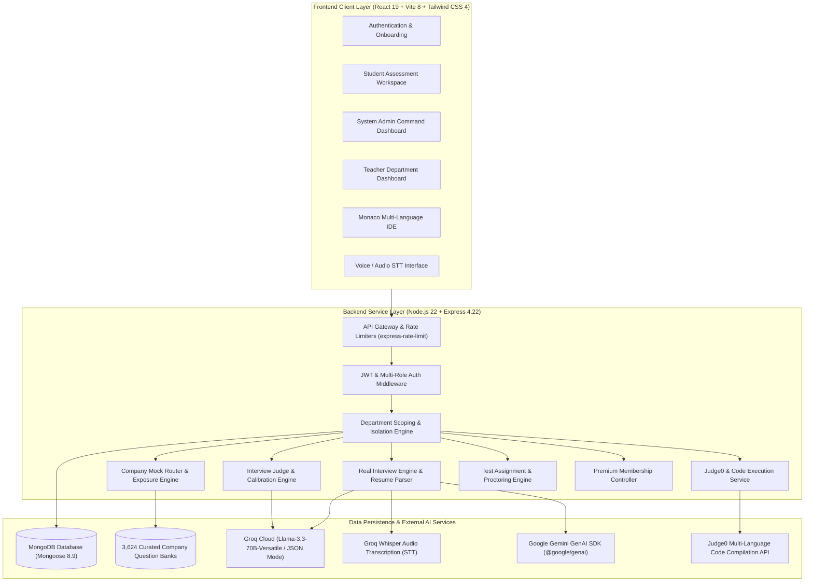
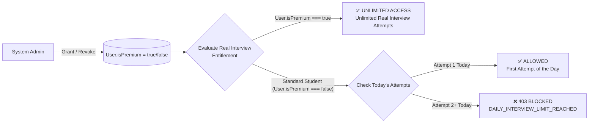
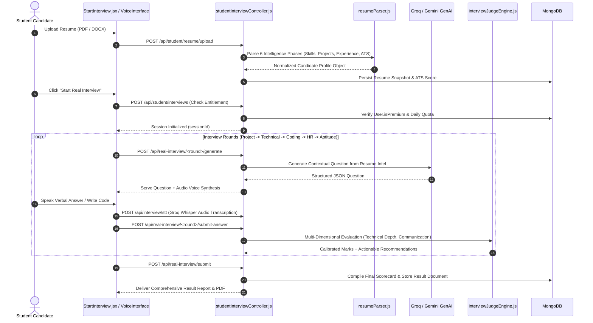
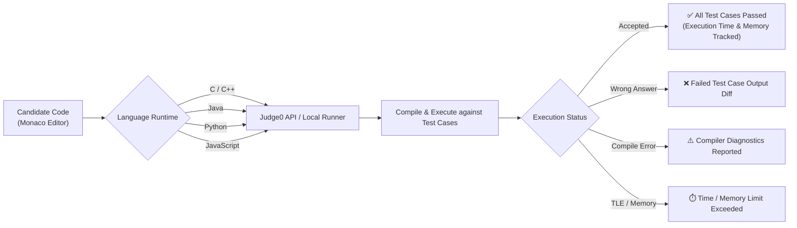
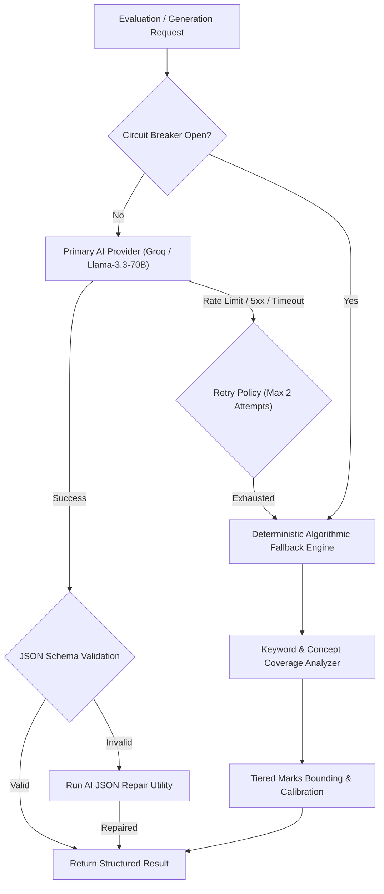
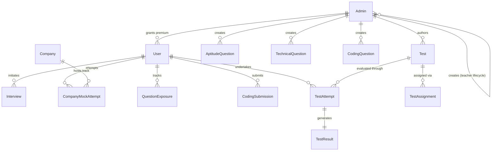
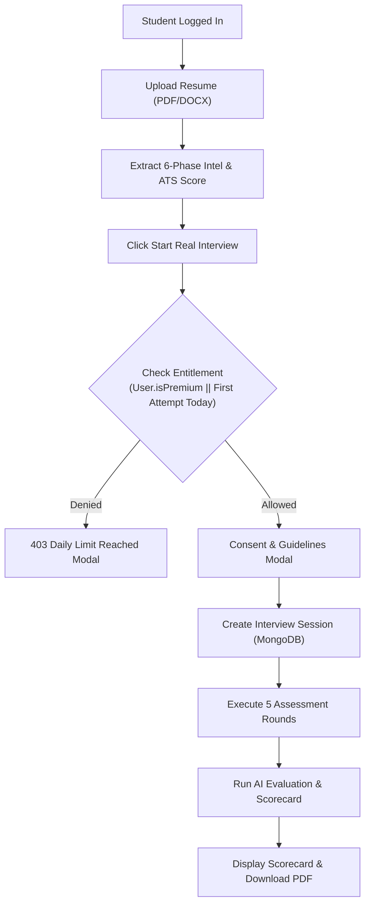
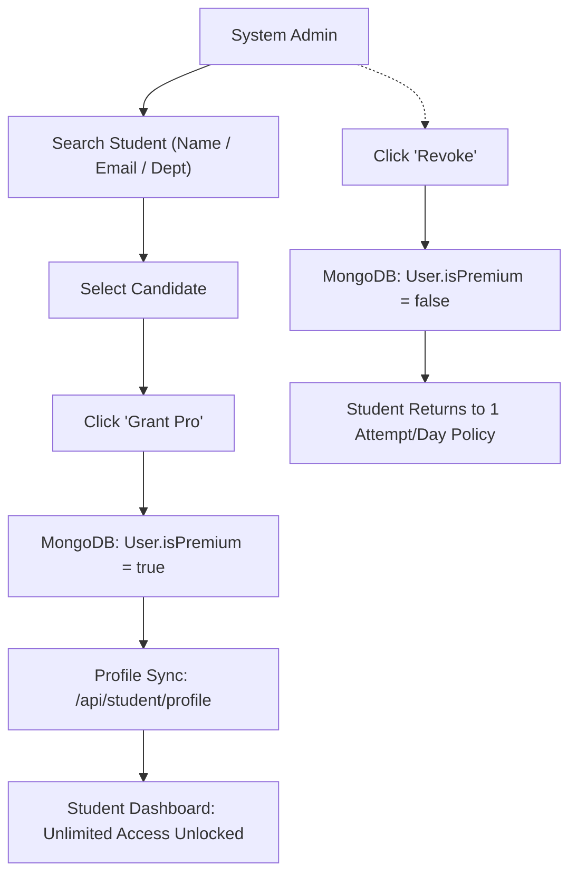

<p align="center">
  
</p>

<h1 align="center">AI Interview Platform</h1>

<p align="center">
  <b>A Production-Grade, Dual-Engine AI Assessment Platform with Two-Level Administration & Premium Candidate Entitlement</b>
</p>

<p align="center">
  
  
  
  
  
  
  
  
</p>

---

## 📋 Table of Contents

- [1. Platform Overview](#1-platform-overview)
- [2. Dual Assessment Engine Architecture](#2-dual-assessment-engine-architecture)
- [3. Multi-Tier Role & Access Architecture](#3-multi-tier-role--access-architecture)
- [4. Premium Membership & Access Entitlement](#4-premium-membership--access-entitlement)
- [5. System Admin & Teacher Portals](#5-system-admin--teacher-portals)
- [6. Real Interview Simulation Engine](#6-real-interview-simulation-engine)
- [7. Company Mock Assessment Engine (9 Tracks)](#7-company-mock-assessment-engine-9-tracks)
- [8. Coding Assessment & Execution IDE](#8-coding-assessment--execution-ide)
- [9. AI Architecture & Multi-Tier Reliability](#9-ai-architecture--multi-tier-reliability)
- [10. Test Engine & Assignment Management](#10-test-engine--assignment-management)
- [11. Centralized Question Bank Management](#11-centralized-question-bank-management)
- [12. Platform Security, Integrity & Anti-Cheating](#12-platform-security-integrity--anti-cheating)
- [13. Database Architecture & Schema Design](#13-database-architecture--schema-design)
- [14. Role & Permission Security Matrix](#14-role--permission-security-matrix)
- [15. Real Interview vs. Company Mock Comparison](#15-real-interview-vs-company-mock-comparison)
- [16. End-to-End System Workflows](#16-end-to-end-system-workflows)
- [17. API Architecture & Endpoint Reference](#17-api-architecture--endpoint-reference)
- [18. Project Directory Structure](#18-project-directory-structure)
- [19. Technology Stack](#19-technology-stack)
- [20. Installation & Setup Guide](#20-installation--setup-guide)
- [21. Environment Variable Configuration](#21-environment-variable-configuration)
- [22. Testing & Quality Assurance](#22-testing--quality-assurance)
- [23. Project Highlights & Future Scope](#23-project-highlights--future-scope)

---

## 1. Platform Overview

**AI Interview Platform** is an enterprise-grade technical interview simulation and campus placement assessment system. Designed for engineering institutes, training academies, and placement cells, it bridges the gap between classroom learning and competitive corporate hiring.

The platform unites two distinct assessment paradigms:
1. **Personalized Resume-Driven Real AI Interviews**: Conversational AI evaluates candidate verbal responses across Project Architecture, Core Technical domains, Coding, and HR Behavioral rounds based on extracted resume intelligence.
2. **Standardized Corporate Mock Assessments**: 9 dedicated company tracks (TCS, Infosys, Cognizant, Wipro, Accenture, Capgemini, Deloitte, Celebal, Benchmark IT Solutions) matching exact corporate Online Assessment (OA) patterns with 3,624 curated questions, adaptive difficulty, and zero-repeat exposure control.

Administration is powered by a **Two-Level Multi-Tenant Architecture** separating institute-wide governance (**System Admin**) from department-isolated management (**Teacher / Department Admin**), backed by an authoritative **Premium Membership Entitlement Engine**.

---

## 2. Dual Assessment Engine Architecture


```mermaid
flowchart TD
    subgraph Client["Frontend Client Layer (React 19 + Vite 8 + Tailwind CSS 4)"]
        AUTH_VIEW["Authentication & Onboarding"]
        STUDENT_PORTAL["Student Assessment Workspace"]
        SYS_ADMIN_PORTAL["System Admin Command Dashboard"]
        TEACHER_PORTAL["Teacher Department Dashboard"]
        MONACO_VIEW["Monaco Multi-Language IDE"]
        VOICE_VIEW["Voice / Audio STT Interface"]
    end

    subgraph API["Backend Service Layer (Node.js 22 + Express 4.22)"]
        GATEWAY["API Gateway & Rate Limiters (express-rate-limit)"]
        AUTH_MW["JWT & Multi-Role Auth Middleware"]
        DEPT_GUARD["Department Scoping & Isolation Engine"]
        
        REAL_SVC["Real Interview Engine & Resume Parser"]
        MOCK_SVC["Company Mock Router & Exposure Engine"]
        JUDGE_SVC["Interview Judge & Calibration Engine"]
        CODE_SVC["Judge0 & Code Execution Service"]
        TEST_SVC["Test Assignment & Proctoring Engine"]
        PREM_SVC["Premium Membership Controller"]
    end

    subgraph DataAI["Data Persistence & External AI Services"]
        MONGO[("MongoDB Database (Mongoose 8.9)")]
        JSON_BANKS[("3,624 Curated Company Question Banks")]
        GROQ_LLM["Groq Cloud (Llama-3.3-70B-Versatile / JSON Mode)"]
        GROQ_STT["Groq Whisper Audio Transcription (STT)"]
        GEMINI_LLM["Google Gemini GenAI SDK (@google/genai)"]
        JUDGE0_API["Judge0 Multi-Language Code Compilation API"]
    end

    Client --> GATEWAY
    GATEWAY --> AUTH_MW
    AUTH_MW --> DEPT_GUARD
    
    DEPT_GUARD --> REAL_SVC & MOCK_SVC & JUDGE_SVC & CODE_SVC & TEST_SVC & PREM_SVC
    
    REAL_SVC --> GROQ_LLM & GROQ_STT & GEMINI_LLM
    MOCK_SVC --> JSON_BANKS
    JUDGE_SVC --> GROQ_LLM
    CODE_SVC --> JUDGE0_API
    
    DEPT_GUARD --> MONGO
```

---

## 3. Multi-Tier Role & Access Architecture

The platform enforces three distinct user roles with strict backend authorization:


```mermaid
graph TD
    SYS_ADMIN["👑 System Admin<br/>(Full Global Platform Governance)"]
    TEACHER["👨‍🏫 Teacher / Department Admin<br/>(Strict Department-Isolated Scoping)"]
    STUDENT["🎓 Student / Candidate<br/>(Personal Profile & Assessments)"]

    SYS_ADMIN -->|Global Control| ALL_DEPTS["All Departments (CS, IT, ENTC, etc.)"]
    SYS_ADMIN -->|Exclusive Authority| TEACHER_MGMT["Teacher Account Creation & Lifecycle"]
    SYS_ADMIN -->|Exclusive Authority| PREM_MGMT["Grant / Revoke Premium Memberships"]
    SYS_ADMIN -->|Global Visibility| ALL_STUDENTS["Platform-Wide Student Roster & Analytics"]
    SYS_ADMIN -->|Global Publishing| GLOBAL_TESTS["Institute-Wide Tests & Questions"]

    TEACHER -->|Isolated Scope| OWN_DEPT["Assigned Department Only"]
    TEACHER -->|Read & Manage| DEPT_STUDENTS["Department Enrolled Students Only"]
    TEACHER -->|Scoped Creation| DEPT_TESTS["Department-Scoped Tests & Assignments"]
    TEACHER -->|Scoped Analytics| DEPT_ANALYTICS["Department Placement Analytics & PDF Reports"]
    TEACHER -.->|BLOCKED 403| OTHER_DEPTS["Other Department Data"]
    TEACHER -.->|BLOCKED 403| PREM_MGMT

    STUDENT -->|Self Access| ASSESSMENTS["Real Interviews & Company Mocks"]
    STUDENT -->|Self Access| CODING_PRACTICE["Monaco Coding & Aptitude Hub"]
    STUDENT -->|Self Access| RESULTS_HISTORY["Personal Scorecards & PDF Downloads"]
```

### Role Descriptions
1. **System Admin (`system_admin`)**: Highest platform administrative level. Holds global access across all departments, manages Teacher credentials and active status, creates global assessments, and manages Pro candidate memberships.
2. **Teacher / Department Admin (`teacher`)**: Scoped to an assigned academic department (e.g., Computer Engineering, Information Technology, Electronics & Telecommunication). Access is strictly restricted server-side to students, test assignments, and performance data belonging to their own department.
3. **Student (`student`)**: Candidate account with access to practice modules, corporate assessments, personalized AI interviews, code playgrounds, and PDF result exports.

---

## 4. Premium Membership & Access Entitlement


```mermaid
flowchart LR
    ADMIN["System Admin"] -->|Grant / Revoke| MONGODB[("User.isPremium = true/false")]
    
    MONGODB --> AUTH_CHECK{"Evaluate Real Interview<br/>Entitlement"}
    
    AUTH_CHECK -- "User.isPremium === true" --> UNLIMITED["✅ UNLIMITED ACCESS<br/>Unlimited Real Interview Attempts"]
    
    AUTH_CHECK -- "Standard Student (User.isPremium === false)" --> DAILY_LIMIT{"Check Today's Attempts"}
    
    DAILY_LIMIT -- "Attempt 1 Today" --> ALLOW["✅ ALLOWED<br/>First Attempt of the Day"]
    DAILY_LIMIT -- "Attempt 2+ Today" --> BLOCK["❌ 403 BLOCKED<br/>DAILY_INTERVIEW_LIMIT_REACHED"]
```

### Business Rules & Entitlement Matrix
- **Authoritative Security**: Access is evaluated directly against the MongoDB `User` record (`User.isPremium === true`) on every session initialization request. Client-side state tampering and email domain spoofing are prevented.
- **Normal Candidate (`isPremium === false`)**: Students without System-Admin-granted Premium status receive **1 Real Interview attempt per calendar day** regardless of email domain.
- **Premium Candidate (`isPremium === true`)**: Receives **unlimited Real Interview attempts** regardless of department or email domain.
- **Account-Based Security**: Email domains (including `@prephire.com`, `@gmail.com`, etc.) do **NOT** determine unlimited access. Only System-Admin-persisted `isPremium: true` status provides unlimited entitlement.
- **Active Session Resume**: Any candidate with an existing `IN_PROGRESS` session started on the current calendar day is permitted to resume their session without consuming an extra attempt.

---

## 5. System Admin & Teacher Portals

### System Admin Capabilities (`/admin/system-dashboard`)
- **Teacher Account Lifecycle (`/admin/teachers`)**: Create teacher accounts with department binding, toggle active status, reset passwords, or delete teachers.
- **Premium Candidate Management (`/admin/premium`)**: Search students across any department, grant Pro privileges, revoke memberships, and view real-time premium conversion ratios.
- **Global Student Roster (`/admin/students`)**: Search, inspect detailed resumes, edit student profiles, download PDF performance reports, and email scorecards.
- **Global Assessment Studio (`/admin/tests/create`, `/admin/tests/assigned`)**: Build and publish institute-wide mock exams with manual or AI question sources.
- **Cross-Department Analytics (`/admin/analytics`)**: Department comparison heatmaps, mock test completion metrics, score distributions, and time-based trends.
- **Company Mock Question Studio (`/admin/mock-questions`, `/admin/coding-questions`, `/admin/technical-questions`, `/admin/aptitude-questions`)**: Full CRUD over central question repositories with duplicate detection and bulk CSV imports.

### Teacher / Department Admin Capabilities (`/admin/dashboard`)
- **Department Student Directory**: View, filter, and inspect performance records exclusively for students enrolled in the teacher's department.
- **Department Test Management**: Author tests scoped to the teacher's department (`departmentScope: "<department>"`), assign tests to specific academic years, and monitor completion.
- **Department Placement Analytics**: Access performance analytics, score distributions, and PDF reports filtered strictly to department cohort metrics.
- **Department Question Authoring**: Add aptitude, technical, and coding questions tagged with department ownership.

---

## 6. Real Interview Simulation Engine


```mermaid
sequenceDiagram
    autonumber
    actor Candidate as Student Candidate
    participant UI as StartInterview.jsx / VoiceInterface
    participant API as studentInterviewController.js
    participant Parser as resumeParser.js
    participant AI as Groq / Gemini GenAI
    participant Judge as interviewJudgeEngine.js
    participant DB as MongoDB

    Candidate->>UI: Upload Resume (PDF / DOCX)
    UI->>API: POST /api/student/resume/upload
    API->>Parser: Parse 6 Intelligence Phases (Skills, Projects, Experience, ATS)
    Parser-->>API: Normalized Candidate Profile Object
    API->>DB: Persist Resume Snapshot & ATS Score

    Candidate->>UI: Click "Start Real Interview"
    UI->>API: POST /api/student/interviews (Check Entitlement)
    API->>DB: Verify User.isPremium & Daily Quota
    API-->>UI: Session Initialized (sessionId)

    loop Interview Rounds (Project -> Technical -> Coding -> HR -> Aptitude)
        UI->>API: POST /api/real-interview/<round>/generate
        API->>AI: Generate Contextual Question from Resume Intel
        AI-->>API: Structured JSON Question
        API-->>UI: Serve Question + Audio Voice Synthesis
        Candidate->>UI: Speak Verbal Answer / Write Code
        UI->>API: POST /api/interview/stt (Groq Whisper Audio Transcription)
        UI->>API: POST /api/real-interview/<round>/submit-answer
        API->>Judge: Multi-Dimensional Evaluation (Technical Depth, Communication)
        Judge-->>API: Calibrated Marks + Actionable Recommendations
    end

    UI->>API: POST /api/real-interview/submit
    API->>DB: Compile Final Scorecard & Store Result Document
    API-->>UI: Deliver Comprehensive Result Report & PDF
```

### Real Interview Round Structure
1. **Resume & Project Round**: Probes architectural decisions, trade-offs, technologies, and individual contributions on candidate-declared projects.
2. **Core Technical Round**: Questions targeting declared skills, frameworks, database designs, and system concepts.
3. **Live Coding Round**: Monaco editor workspace with automated test cases and runtime execution analysis.
4. **HR & Behavioral Round**: Situational, leadership, conflict-resolution, and culture-fit assessments.
5. **Aptitude Round**: Timed quantitative, logical reasoning, and verbal ability evaluation.

---

## 7. Company Mock Assessment Engine (9 Tracks)

The platform includes **9 dedicated corporate mock hiring tracks** patterned after official Online Assessments (OAs). Assessments feature **3,624 verified questions** distributed across Aptitude MCQs, Technical TITA/MCQ questions, and Coding challenges.

| Company Track | Target Corporate Role | Total Questions | Assessment Breakdown | Key Isolation Client |
| :--- | :--- | :---: | :--- | :--- |
| **TCS** | Ninja / Digital Developer | 380 | 175 Aptitude + 170 Technical + 35 Coding | `tcsAiClient.js` |
| **Infosys** | SE / Specialist Programmer | 395 | 201 Aptitude + 162 Technical + 32 Coding | `shared2AiClient.js` |
| **Cognizant** | GenC / GenC Next Engineer | 402 | 210 Aptitude + 160 Technical + 32 Coding | `shared2AiClient.js` |
| **Wipro** | Elite / NLTH Candidate | 533 | 150 Aptitude + 380 Technical + 3 Coding | `mockAiClient.js` |
| **Accenture** | Associate Software Engineer | 417 | 210 Aptitude + 175 Technical + 32 Coding | `accentureAiClient.js` |
| **Capgemini** | Software Analyst / Engineer | 402 | 210 Aptitude + 160 Technical + 32 Coding | `shared2AiClient.js` |
| **Deloitte** | Analyst / Technology Advisor | 395 | 201 Aptitude + 162 Technical + 32 Coding | `shared2AiClient.js` |
| **Celebal Tech** | Software / Data Engineer | 448 | 238 Aptitude + 210 Technical | `mockAiClient.js` |
| **Benchmark IT** | Full-Stack Software Developer | 402 | 210 Aptitude + 160 Technical + 32 Coding | `benchmarkAiClient.js` |
| **Total** | **9 Hiring Tracks** | **3,624** | **Standard 60-Minute Assessment Format** | **Strict API Key Isolation** |

### Zero-Repeat Exposure Control (`QuestionExposure.js`)
To prevent memorization across repeated attempts, candidate question exposure is tracked in the `QuestionExposure` collection. On subsequent attempts, previously answered questions are filtered out. When the company pool is fully exhausted, the candidate's exposure cycle resets automatically.

---

## 8. Coding Assessment & Execution IDE


```mermaid
flowchart LR
    CODE_INPUT["Candidate Code<br/>(Monaco Editor)"] --> LANG_SELECT{"Language Runtime"}
    
    LANG_SELECT -- C / C++ --> RUNNER["Judge0 API / Local Runner"]
    LANG_SELECT -- Java --> RUNNER
    LANG_SELECT -- Python --> RUNNER
    LANG_SELECT -- JavaScript --> RUNNER
    
    RUNNER --> EXEC["Compile & Execute against Test Cases"]
    EXEC --> COMP_CHECK{"Execution Status"}
    
    COMP_CHECK -- Accepted --> PASS["✅ All Test Cases Passed<br/>(Execution Time & Memory Tracked)"]
    COMP_CHECK -- Wrong Answer --> FAIL["❌ Failed Test Case Output Diff"]
    COMP_CHECK -- Compile Error --> ERR["⚠️ Compiler Diagnostics Reported"]
    COMP_CHECK -- TLE / Memory --> LIMIT["⏱️ Time / Memory Limit Exceeded"]
```

### Monaco Editor Features (`MonacoCodeEditor.jsx`)
- **Supported Languages**: Java (OpenJDK 17), Python (Python 3.10), C++ (GCC 11), C (GCC 11), JavaScript (Node.js 20).
- **Boilerplate Generators**: Pre-populates class definitions, standard input (`Scanner`/`cin`/`sys.stdin`) readers, and starter functions.
- **Test Case Runner**: Executes against public sample cases and hidden verification test cases with execution time (ms) and memory (KB) metrics.
- **Autosave Engine**: Periodically saves editor buffer state to `CodingAutosave` to prevent code loss.

---

## 9. AI Architecture & Multi-Tier Reliability


```mermaid
flowchart TD
    REQUEST["Evaluation / Generation Request"] --> CIRCUIT{"Circuit Breaker Open?"}
    
    CIRCUIT -- No --> GROQ_EXEC["Primary AI Provider (Groq / Llama-3.3-70B)"]
    GROQ_EXEC -- Success --> JSON_VALIDATE{"JSON Schema Validation"}
    JSON_VALIDATE -- Valid --> RETURN["Return Structured Result"]
    
    JSON_VALIDATE -- Invalid --> JSON_REPAIR["Run AI JSON Repair Utility"]
    JSON_REPAIR -- Repaired --> RETURN
    
    CIRCUIT -- Yes --> FALLBACK["Deterministic Algorithmic Fallback Engine"]
    GROQ_EXEC -- Rate Limit / 5xx / Timeout --> RETRY{"Retry Policy (Max 2 Attempts)"}
    RETRY -- Exhausted --> FALLBACK
    
    FALLBACK --> CONCEPT_MATCH["Keyword & Concept Coverage Analyzer"]
    CONCEPT_MATCH --> BOUND_SCORE["Tiered Marks Bounding & Calibration"]
    BOUND_SCORE --> RETURN
```

### BYOK (Bring Your Own Key) Support
Candidates can optionally provide their own personal AI API key (Groq, Gemini, or OpenRouter) via the BYOK interface (`/api/real-interview/byok/set-session-key`). When supplied, the session securely routes evaluation traffic through the candidate's personal API quota while falling back to platform keys if needed.

---

## 10. Test Engine & Assignment Management

- **Scheduled & Live Testing**: Tests support scheduled start/end windows, automatic status transitions (`draft` $\to$ `scheduled` $\to$ `live` $\to$ `completed`), and strict durations.
- **Department-Scoped Assignments**: Tests can be assigned institute-wide or restricted to specific academic departments and years.
- **Anti-Cheat Strike Limit**: Tab switches, window minimizations, and fullscreen exits are tracked in real time. Exceeding 3 strikes triggers automatic test submission.

---

## 11. Centralized Question Bank Management

The platform maintains centralized repositories for all assessment modalities:
- **Aptitude Questions (`AptitudeQuestion.js`)**: Quantitative, Logical, Verbal, and CS core topics with category filters, difficulty tags, and duplicate detection.
- **Technical Questions (`TechnicalQuestion.js`)**: Conceptual, scenario-based, and code-tracing questions with expected answers and explanations.
- **Coding Problems (`CodingQuestion.js`)**: Full algorithmic challenges with problem statements, constraints, sample I/O, hidden test cases, and starter code templates.
- **Ownership Scoping**: Questions support `departmentScope: "global"` (System Admin) or `departmentScope: "<department>"` (Teacher-owned).

---

## 12. Platform Security, Integrity & Anti-Cheating

- **JWT Authentication**: Signed with `HMAC-SHA256` containing user ID, normalized role, and department claim.
- **Password Protection**: `bcryptjs` salted hashing with 10 salt rounds.
- **Express Middleware Security**:
  - `helmet`: Secure HTTP response headers.
  - `express-rate-limit`: Global API rate limiting.
  - `express-mongo-sanitize`: Sanitizes request data against MongoDB operator injection (`$`, `.`).
  - `cors`: Restricted cross-origin resource sharing.
- **Assessment Proctoring Controls**:
  - Fullscreen enforcement with `FullscreenExitOverlay.jsx`.
  - Tab switch and window blur tracking via `visibilitychange` listeners.
  - Copy/paste and right-click context menu restrictions.
  - Post-timer submission lockout.

---

## 13. Database Architecture & Schema Design


```mermaid
erDiagram
    User ||--o{ Interview : "initiates"
    User ||--o{ CompanyMockAttempt : "attempts"
    User ||--o{ QuestionExposure : "tracks"
    User ||--o{ CodingSubmission : "submits"
    User ||--o{ TestAttempt : "undertakes"
    
    Admin ||--o{ Admin : "creates (teacher lifecycle)"
    Admin ||--o{ User : "grants premium"
    Admin ||--o{ Test : "authors"
    Admin ||--o{ AptitudeQuestion : "creates"
    Admin ||--o{ TechnicalQuestion : "creates"
    Admin ||--o{ CodingQuestion : "creates"
    
    Test ||--o{ TestAssignment : "assigned via"
    Test ||--o{ TestAttempt : "evaluated through"
    TestAttempt ||--|| TestResult : "generates"
    
    Company ||--o{ CompanyMockAttempt : "hosts track"
```

### Core Models Summary
- **`User.js`**: Student profiles, resume data, ATS score, academic details, and `isPremium` status.
- **`Admin.js`**: Administrative accounts for `system_admin` and `teacher` with department binding and active status.
- **`Interview.js`**: Master session state for Real Interviews across all 5 assessment rounds.
- **`CompanyMockAttempt.js`**: Section scores, question answers, and completion status for corporate mock assessments.
- **`QuestionExposure.js`**: Per-student company question exposure records for zero-repeat selection.
- **`Test.js` & `TestAssignment.js`**: Configured online tests, schedules, attempt limits, and assigned cohorts.
- **`CodingQuestion.js` & `CodingSubmission.js`**: Coding challenge definitions, test cases, and compilation logs.

---

## 14. Role & Permission Security Matrix

| Feature / Action | Student | Teacher / Dept Admin | System Admin |
| :--- | :---: | :---: | :---: |
| **Authentication & Profile Management** | ✅ Self Only | ✅ Self Only | ✅ Full Platform |
| **Real AI Interview Simulation** | ✅ Subject to Quota | ❌ | ❌ |
| **Company Mock Hiring Assessments** | ✅ (9 Tracks) | ❌ | ❌ |
| **Monaco Coding IDE & Practice Hub** | ✅ Unlimited | ❌ | ❌ |
| **Student Roster Management** | ❌ | ✅ Own Department Only | ✅ All Departments |
| **Student Detail & Resume Inspection** | ❌ | ✅ Own Department Only | ✅ All Departments |
| **Teacher Account Management** | ❌ | ❌ (Blocked 403) | ✅ Create, Edit, Toggle, Delete |
| **Premium Membership Management** | ❌ | ❌ (Blocked 403) | ✅ Grant, Revoke, Analytics |
| **Question Authoring (Aptitude/Tech/Coding)** | ❌ | ✅ Department Scoped | ✅ Global / All Departments |
| **Test Creation & Scheduling** | ❌ | ✅ Department Scoped | ✅ Global / All Departments |
| **Test Assignment to Cohorts** | ❌ | ✅ Own Department Cohorts | ✅ Institute-Wide Cohorts |
| **Cross-Department Analytics** | ❌ | ❌ (Own Dept Only) | ✅ All Departments Comparison |
| **PDF & CSV Report Export** | ✅ Own Reports | ✅ Department Cohorts | ✅ Global Cohorts |
| **System Audit Logs & Platform Config** | ❌ | ❌ (Blocked 403) | ✅ Full Access |

---

## 15. Real Interview vs. Company Mock Comparison

| Dimension | Real Interview Engine | Company Mock Engine |
| :--- | :--- | :--- |
| **Primary Objective** | Personalized candidate practice | Standardized corporate hiring simulation |
| **Question Source** | Dynamic AI generated from resume | Curated 3,624 company question banks |
| **Resume Dependency** | **Mandatory** (PDF/DOCX extraction) | None (Standardized hiring criteria) |
| **Corporate Tracks** | Candidate's personal background | 9 Corporate Tracks (TCS, Infosys, etc.) |
| **Assessment Format** | Conversational verbal voice Q&A + Coding | 15 Aptitude MCQs + 15 Tech TITA + 3 Coding |
| **Time Limit** | Dynamic round pacing | Strict 60-minute countdown timer |
| **Attempt Quota** | 1/day for standard; Unlimited for Pro & Prephire | Maximum 2 concurrent unfinished attempts |
| **Exposure Control** | Dynamic prompt generation | MongoDB-backed `QuestionExposure` tracking |
| **Evaluation Method** | Multi-dimensional AI judge & rubric | Automated MCQ key + AI TITA + Judge0 |

---

## 16. End-to-End System Workflows

### A. Real Interview Lifecycle

```mermaid
flowchart TD
    START["Student Logged In"] --> UPLOAD["Upload Resume (PDF/DOCX)"]
    UPLOAD --> EXTRACT["Extract 6-Phase Intel & ATS Score"]
    EXTRACT --> START_INT["Click Start Real Interview"]
    START_INT --> ENTITLEMENT{"Check Entitlement<br/>(User.isPremium || First Attempt Today)"}
    
    ENTITLEMENT -- Denied --> BLOCKED["403 Daily Limit Reached Modal"]
    ENTITLEMENT -- Allowed --> CONSENT["Consent & Guidelines Modal"]
    CONSENT --> SESSION["Create Interview Session (MongoDB)"]
    SESSION --> ROUNDS["Execute 5 Assessment Rounds"]
    ROUNDS --> EVALUATE["Run AI Evaluation & Scorecard"]
    EVALUATE --> REPORT["Display Scorecard & Download PDF"]
```

### B. Premium Grant & Revoke Flow

```mermaid
flowchart TD
    SYS_ADMIN["System Admin"] --> SEARCH["Search Student (Name / Email / Dept)"]
    SEARCH --> SELECT["Select Candidate"]
    SELECT --> GRANT["Click 'Grant Pro'"]
    GRANT --> DB_UPDATE["MongoDB: User.isPremium = true"]
    DB_UPDATE --> SYNC["Profile Sync: /api/student/profile"]
    SYNC --> UNLOCK["Student Dashboard: Unlimited Access Unlocked"]
    
    SYS_ADMIN -.-> REVOKE["Click 'Revoke'"]
    REVOKE --> DB_REVOKE["MongoDB: User.isPremium = false"]
    DB_REVOKE --> RELOCK["Student Returns to 1 Attempt/Day Policy"]
```

---

## 17. API Architecture & Endpoint Reference

### Authentication Routes (`/api/auth`)
- `POST /api/auth/signup`: Register new student account.
- `POST /api/auth/login`: Authenticate student, teacher, or system admin.
- `POST /api/auth/forgot-password`: Send password reset OTP via email.
- `POST /api/auth/verify-otp`: Validate 6-digit OTP.
- `POST /api/auth/reset-password`: Reset account password with token.

### System Admin & Teacher Routes (`/api/admin`)
- `POST /api/admin/teachers`: Create teacher account (`system_admin` only).
- `GET /api/admin/teachers`: List all teachers with department and status filters (`system_admin` only).
- `PUT /api/admin/teachers/:id`: Update teacher details (`system_admin` only).
- `PATCH /api/admin/teachers/:id/status`: Toggle teacher active status (`system_admin` only).
- `POST /api/admin/teachers/:id/reset-password`: Reset teacher password (`system_admin` only).
- `DELETE /api/admin/teachers/:id`: Delete teacher account (`system_admin` only).
- `GET /api/admin/premium/users`: Paginated list of active Premium members (`system_admin` only).
- `POST /api/admin/premium/grant`: Grant Premium membership to student (`system_admin` only).
- `POST /api/admin/premium/revoke`: Revoke Premium membership (`system_admin` only).
- `GET /api/admin/premium/search`: Search candidate students for Premium modal (`system_admin` only).
- `GET /api/admin/premium/stats`: Platform premium ratio and department breakdowns (`system_admin` only).
- `GET /api/admin/students`: Department-filtered (Teacher) or global (System Admin) student roster.
- `GET /api/admin/students/:id`: Detailed student profile, ATS intelligence, and attempt history.
- `GET /api/admin/analytics/overview`: High-level platform assessment KPIs.
- `GET /api/admin/analytics/departments`: Cross-department comparative analytics.

### Student Real Interview Routes (`/api/student`, `/api/real-interview`)
- `GET /api/student/profile`: Retrieve student profile and ATS resume intelligence.
- `PUT /api/student/profile`: Update contact details, skills, and target company.
- `POST /api/student/resume/upload`: Upload PDF/DOCX resume and trigger intelligence parsing.
- `GET /api/student/interviews/eligibility`: Check daily attempt eligibility based on Premium / Prephire status.
- `POST /api/student/interviews`: Initialize or resume an active Real Interview session.
- `POST /api/interview/stt`: Transcribe verbal answer audio via Groq Whisper with technical biasing.
- `POST /api/real-interview/submit`: Finalize Real Interview and trigger multi-round evaluation.
- `GET /api/real-interview/result/:sessionId`: Retrieve comprehensive result scorecard.
- `GET /api/real-interview/result/:sessionId/pdf`: Download formatted PDF performance report.
- `POST /api/real-interview/byok/set-session-key`: Bind personal API key for BYOK execution.

### Company Mock Assessment Routes (`/api/mock-interview`)
- `POST /api/mock-interview/start`: Load company question pool with exposure control.
- `POST /api/mock-interview/save`: Autosave draft answers and timer state.
- `GET /api/mock-interview/resume`: Resume in-progress company mock attempt.
- `POST /api/mock-interview/submit`: Grade MCQs, evaluate TITA responses, and store results.
- `GET /api/mock-interview/result/:attemptId`: Retrieve detailed mock assessment scorecard.

### Code Compilation Routes (`/api/code`)
- `POST /api/code/run`: Execute code with custom inputs via Judge0 API.
- `POST /api/code/submit`: Execute code against hidden test cases and calculate scores.

---

## 18. Project Directory Structure

```text
ai-interview-engine/
├── backend/
│   ├── config/             # Database connection (connectDB)
│   ├── controllers/        # Route controllers (Auth, Admin, Student, Premium, Mock, Coding)
│   ├── data/companyMock/   # 3,624 Curated JSON question banks (9 company folders)
│   ├── middleware/         # authMiddleware, role authorization, rate limiters
│   ├── models/             # 46 Mongoose models (User, Admin, Interview, Test, Questions)
│   ├── routes/             # RESTful API route definitions
│   ├── services/           # AI services, Judge0 client, resume parser, placement engine
│   │   ├── ai/             # Centralized AI clients (Groq)
│   │   ├── aiReliability/  # Circuit breakers, retry policies, JSON repair, providers
│   │   └── realInterviewAI/# Question generators, answer preprocessors, judge engine
│   └── utils/              # PDF generators, normalizers, token generators, seed defaults
├── frontend/
│   ├── src/
│   │   ├── components/     # UI components (Monaco editor, modals, timers, charts)
│   │   ├── hooks/          # Custom hooks (useStudentProfile, useFullscreen)
│   │   ├── layouts/        # AdminLayout, StudentLayout
│   │   ├── pages/          # Student & Admin dashboards, interview control rooms, reports
│   │   │   ├── admin/      # SystemAdminDashboard, TeacherManagement, PremiumManagement
│   │   │   └── student/    # StartInterview, CompanyMockInterview, CodingRound, Results
│   │   ├── routes/         # AppRoutes route definitions & protections
│   │   └── utils/          # Axios API instance, data normalizers, coding configs
│   ├── package.json        # Frontend dependencies (React 19, Tailwind 4, Monaco, Recharts)
│   └── vite.config.js      # Vite build configuration and backend proxy
├── package.json            # Backend dependencies (Express, Mongoose, @google/genai, Groq)
├── realinterviewcodingque.json # 152 Curated Real Interview coding questions
├── server.js               # Express application entry point & route mounting
└── README.md               # Master technical documentation
```

---

## 19. Technology Stack

### Frontend
- **Framework**: React 19.2.7 + Vite 8.1.1
- **Styling**: Tailwind CSS 4.3.2 + Framer Motion 12.42.2 + Lucide React 1.24.0
- **Code Editor**: Monaco Editor (`@monaco-editor/react` 4.7.0, `monaco-editor` 0.56.0)
- **Data Visualization**: Recharts 3.10.1
- **HTTP Client**: Axios 1.18.1
- **Notifications**: React Hot Toast 2.6.0

### Backend
- **Runtime & Framework**: Node.js 22.x + Express 4.22.3 (ES Modules)
- **Database & ODM**: MongoDB Atlas + Mongoose 8.9.0
- **Authentication**: JSON Web Tokens (`jsonwebtoken` 9.0.0) + `bcryptjs` 2.4.3
- **Security**: `helmet` 8.3.0 + `express-rate-limit` 8.6.0 + `express-mongo-sanitize` 2.2.0 + `cors` 2.8.5
- **Document & PDF Processing**: `pdfjs-dist` 4.10.38 + `mammoth` 1.12.1 + `pdfkit` 0.19.1 + `jspdf` 4.2.1
- **Email Delivery**: `nodemailer` 9.0.3
- **Spreadsheets**: `xlsx` 0.18.5 + `file-saver` 2.0.5

### AI & Code Execution
- **LLM Engine**: Groq Cloud (`Llama-3.3-70b-versatile` in JSON mode) + Google Gemini GenAI SDK (`@google/genai` 1.0.0) + OpenRouter SDK (`@openrouter/sdk` 1.2.54)
- **Audio STT**: Groq Whisper (`whisper-large-v3` / `whisper-large-v3-turbo`)
- **Code Compilation**: Judge0 REST API Engine

---

## 20. Installation & Setup Guide

### Prerequisites
- **Node.js**: v18.0.0 or higher (v22.x recommended)
- **npm**: v9.0.0 or higher
- **MongoDB**: Local MongoDB instance or MongoDB Atlas URI

### 1. Clone the Repository
```bash
git clone https://github.com/Tushar-3612/AI-Interview-Platform.git
cd AI-Interview-Platform
```

### 2. Install Dependencies
```bash
# Install backend dependencies
npm install

# Install frontend dependencies
cd frontend
npm install
cd ..
```

### 3. Configure Environment Variables
Create a `.env` file in the root directory (see [Environment Variable Configuration](#21-environment-variable-configuration)).

### 4. Launch Development Servers
```bash
# Terminal 1: Start Backend Server (Port 5000)
npm run dev

# Terminal 2: Start Frontend Vite Server (Port 5173)
cd frontend
npm run dev
```

### 5. Access the Platform
- **Student & Admin Login**: `http://localhost:5173`
- **Default System Admin Credentials**:
  - **Email**: `sanjivani@admin.org.in`
  - **Password**: `Admin@123`

---

## 21. Environment Variable Configuration

Create a `.env` file in the project root with the following keys:

| Variable | Purpose | Required | Example / Format |
| :--- | :--- | :---: | :--- |
| `PORT` | Express server port | No (Default: 5000) | `5000` |
| `MONGO_URI` | MongoDB connection string | **Yes** | `mongodb+srv://<user>:<password>@cluster.mongodb.net/ai_interview` |
| `JWT_SECRET` | Secret for signing JWT authentication tokens | **Yes** | `your_super_secret_jwt_key_2026` |
| `AI_PROVIDER` | Active AI provider flag | **Yes** | `groq` |
| `AI_API_KEY` | Primary Groq API Key (starts with `gsk_`) | **Yes** | `gsk_xxxxxxxxxxxxxxxxxxxx` |
| `AI_MODEL` | Groq LLM model identifier | **Yes** | `llama-3.3-70b-versatile` |
| `GEMINI_API_KEY` | Google Gemini API key for GenAI SDK | Optional | `AIzaSyxxxxxxxxxxxxxxxxxxxx` |
| `MOCK_INTERVIEW_API_KEY` | Dedicated key for Celebal & Wipro tracks | Optional | `gsk_xxxxxxxxxxxxxxxxxxxx` |
| `MOCK_INTERVIEW_API_KEY2`| Dedicated key for Capgemini, Deloitte, Infosys | Optional | `gsk_xxxxxxxxxxxxxxxxxxxx` |
| `TCS_MOCK_KEY` | Dedicated key for TCS track | Optional | `gsk_xxxxxxxxxxxxxxxxxxxx` |
| `ACCENTURE_MOCK_KEY` | Dedicated key for Accenture track | Optional | `gsk_xxxxxxxxxxxxxxxxxxxx` |
| `BENCHMARK_MOCK_KEY` | Dedicated key for Benchmark track | Optional | `gsk_xxxxxxxxxxxxxxxxxxxx` |
| `JUDGE0_API_URL` | Judge0 code compilation endpoint | Optional | `https://judge0-ce.p.rapidapi.com` |
| `SMTP_HOST` | SMTP server host for OTP & report delivery | Optional | `smtp.gmail.com` |
| `SMTP_PORT` | SMTP server port | Optional | `587` |
| `SMTP_USER` | SMTP username / email address | Optional | `placement@sanjivani.edu.in` |
| `SMTP_PASS` | SMTP password / App password | Optional | `your_app_password` |

---

## 22. Testing & Quality Assurance

The repository includes test suites and build verification commands:

```bash
# 1. Verify Frontend Production Build
npm --prefix frontend run build

# 2. Validate Question Banks Across All 9 Companies
node backend/scripts/companyMock/testInfosysQuestionBank.js
node backend/scripts/companyMock/testDeloitteQuestionBank.js
node backend/scripts/companyMock/testCognizantQuestionBank.js
node backend/scripts/companyMock/testCapgeminiQuestionBank.js
node backend/scripts/companyMock/testBenchmarkQuestionBank.js
node backend/scripts/testAccentureQuestionBank.js
node backend/scripts/testTcsQuestionBank.js

# 3. Test SMTP Email Delivery
node backend/scripts/testSmtp.js
```

---

## 23. Project Highlights & Future Scope

### Implemented Project Highlights
- **Dual Assessment Architecture**: Seamlessly integrates personalized resume interviews with standardized corporate hiring mocks.
- **Two-Level Administrative Hierarchy**: Distinguishes institute-wide System Admins from department-isolated Teachers.
- **Authoritative Premium Entitlement**: Backed by secure MongoDB storage and daily limit bypass logic.
- **9 Corporate Recruitment Tracks**: 3,624 verified questions with adaptive difficulty and zero-repeat exposure control.
- **Monaco Multi-Language IDE**: Integrated compilation with Judge0, execution metrics, and hidden test-case verification.
- **Robust AI Reliability**: Multi-tier evaluation fallback with deterministic concept matching and JSON auto-repair.

### Future Scope (Planned Enhancements)
- **Multi-Modal AI Proctoring**: Web-cam gaze tracking and background noise detection for automated proctoring.
- **Expanded Company Catalog**: Additional recruitment tracks for Amazon, Microsoft, and Google hiring patterns.
- **Low-Latency Full-Duplex Voice Streaming**: WebSockets audio streaming for real-time natural conversational interviews.
- **Mobile Native Application**: React Native mobile app for on-the-go practice assessments.

---

<p align="center">
  <b>AI Interview Platform — Developed for Technical Interview Preparation & Automated Hiring Assessment</b>
</p>
