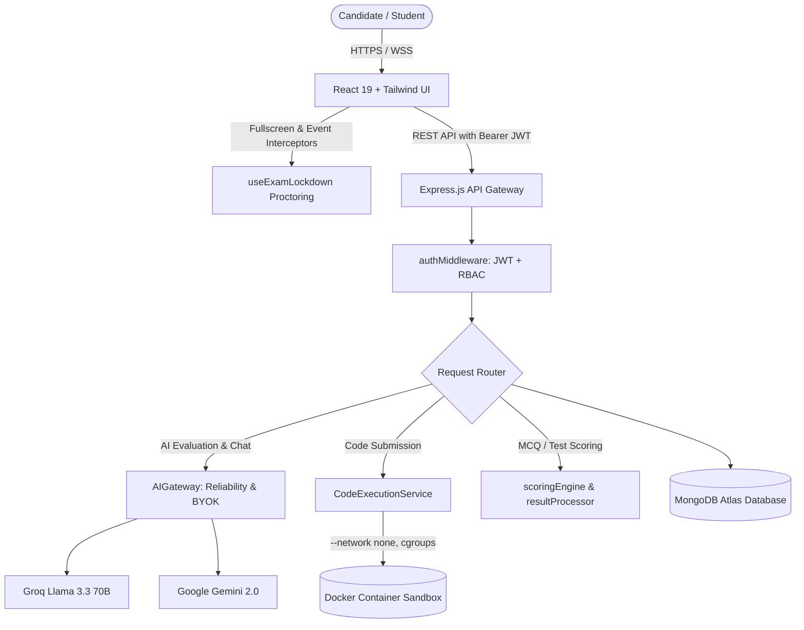

# AI Interview & Assessment Platform — System Documentation & Source Code Reference

> **Project Report Chapter:** System Implementation & Core Code Algorithms  
> **Course / Degree:** Final Year Engineering Project / B.Tech / BE / MCA  
> **Repository:** `AI-Interview-Platform`  
> **Generated:** March 2025  

---

## 📑 Table of Contents
1. [Executive Summary & System Architecture](#1-executive-summary--system-architecture)
2. [Module 1: Resilient Multi-Provider AI Gateway & Fallback](#2-module-1-resilient-multi-provider-ai-gateway--fallback)
3. [Module 2: Isolated Docker Code Execution Sandbox](#3-module-2-isolated-docker-code-execution-sandbox)
4. [Module 3: Exam Lockdown & Anti-Cheating Proctoring Hook](#4-module-3-exam-lockdown--anti-cheating-proctoring-hook)
5. [Module 4: Automated Scoring & Negative Marking Algorithm](#5-module-4-automated-scoring--negative-marking-algorithm)
6. [Module 5: JWT Authentication & Role-Based Access Control (RBAC)](#6-module-5-jwt-authentication--role-based-access-control-rbac)
7. [Module 6: Test Attempt State Lifecycle & Submission Handler](#7-module-6-test-attempt-state-lifecycle--submission-handler)
8. [Database Schema Specifications (Mongoose Models)](#8-database-schema-specifications-mongoose-models)
9. [Core REST API Endpoint Directory](#9-core-rest-api-endpoint-directory)

---

## 1. Executive Summary & System Architecture

### 1.1 Overview
The **AI Interview Platform** is a dual-engine technical assessment platform designed for engineering institutes and placement training cells. It combines:
1. **Dynamic Resume-Driven AI Interviews:** Natural language interview dialogue evaluated across Project Architecture, Technical Knowledge, Coding, and HR Behavioral rounds.
2. **Standardized Online Corporate Mocks:** Realistic exam conditions with anti-cheating, code running sandboxes, question randomization, negative marking, and detailed percentile rankings.

### 1.2 High-Level Architecture Flowchart



---

## 2. Module 1: Resilient Multi-Provider AI Gateway & Fallback

- **Source File Path:** `backend/modules/ai/reliability/aiGateway.js`
- **Purpose:** Coordinates LLM evaluation requests across Groq, Gemini, and DeepSeek with circuit breaking, session BYOK priority, retry mechanisms, and automated JSON payload repair.

```javascript
import { providerRegistry } from "./aiProviderRegistry.js";
import { circuitBreaker } from "./aiCircuitBreaker.js";
import { requestDeduplicator } from "./aiRequestDeduplicator.js";
import { AIRetryPolicy } from "./aiRetryPolicy.js";
import { AIJsonRepair } from "./aiJsonRepair.js";
import { sessionManager } from "./aiSessionManager.js";
import { safeLogger } from "./utils/safeLogger.js";

/**
 * Resolves the appropriate model for the given provider to avoid mismatch.
 */
export function resolveProviderModel(providerName, requestedModel) {
  const p = String(providerName).toLowerCase().trim();
  const groqDefault = (process.env.GROQ_MODEL || process.env.AI_MODEL || "openai/gpt-oss-120b").trim();
  const providerDefaultModels = {
    groq: groqDefault,
    gemini: "gemini-3.8-flash",
    openrouter: "openai/gpt-oss-120b",
    deepseek: "deepseek-v4.1-flash",
    openai: "gpt-6"
  };

  if (!requestedModel || typeof requestedModel !== "string") {
    return providerDefaultModels[p] || groqDefault;
  }
  return requestedModel;
}

/**
 * Central AI Gateway coordinating request reliability, BYOK keys, retries,
 * deduplication, circuit breaking, and JSON repair.
 */
export class AIGateway {
  /**
   * Main completion method.
   * Priority: Session BYOK Key > Request Direct Key > Platform Shared Pool
   */
  static async execute({
    prompt,
    systemPrompt = "",
    provider = "groq",
    apiKey,
    sessionId,
    roundType = "general",
    orderIndex,
    options = {}
  }) {
    let mode = "PLATFORM";
    let activeProviderName = provider;
    let activeApiKey = apiKey;
    let fallbackAllowed = true;

    // 1. Session BYOK Verification (Highest Priority)
    if (sessionId) {
      const sessionBYOK = sessionManager.getSessionBYOK(sessionId);
      if (sessionBYOK?.apiKey) {
        mode = "BYOK";
        activeProviderName = sessionBYOK.providerName;
        activeApiKey = sessionBYOK.apiKey;
        fallbackAllowed = false; // Never leak platform keys if BYOK is active
      }
    }

    // 2. Direct Request Key Check (Second Priority)
    if (mode !== "BYOK" && apiKey && typeof apiKey === "string" && apiKey.trim() !== "") {
      mode = "BYOK";
      activeProviderName = provider || "groq";
      activeApiKey = apiKey.trim();
      fallbackAllowed = false;
    }

    // 3. Request Deduplication to avoid duplicate parallel inference calls
    const requestKey = requestDeduplicator.generateKey(sessionId, roundType, orderIndex);
    return await requestDeduplicator.dedupe(requestKey, async () => {
      // 4. Circuit Breaker protection against failing AI endpoints
      return await circuitBreaker.execute(activeProviderName, async () => {
        const client = providerRegistry.getProvider(activeProviderName);

        // 5. Execution with Exponential Backoff Retry Policy
        const rawResponse = await AIRetryPolicy.executeWithRetry(async () => {
          return await client.complete({
            prompt,
            systemPrompt,
            apiKey: activeApiKey,
            ...options
          });
        });

        // 6. Automated JSON Sanitization & Malformed Syntax Repair
        return AIJsonRepair.sanitizeAndParse(rawResponse);
      });
    });
  }
}
```

---

## 3. Module 2: Isolated Docker Code Execution Sandbox

- **Source File Path:** `backend/modules/codingAssessment/services/codeExecutionService.js`
- **Purpose:** Executes student-submitted code in Java, C++, C, Python, and JavaScript inside containerized environments with kernel-level resource restrictions.

```javascript
import { spawn } from "child_process";
import fsp from "fs/promises";
import path from "path";

/**
 * Docker Sandbox Configuration
 */
const SECURITY_LIMITS = {
  MEMORY_LIMIT: process.env.CODE_MEMORY_LIMIT || "256m",
  CPU_LIMIT: process.env.CODE_CPU_LIMIT || "0.5",
  PIDS_LIMIT: process.env.CODE_PIDS_LIMIT || "64",
  TIMEOUT_MS: parseInt(process.env.CODE_TIMEOUT_MS, 10) || 5000,
};

/**
 * Executes source code inside an isolated ephemeral Docker container.
 * Enforces strict network isolation, memory limits, and timeout triggers.
 */
export async function executeContainer({
  languageConfig,
  sourceCode,
  stdin = "",
  timeoutMs = SECURITY_LIMITS.TIMEOUT_MS,
  tempDir
}) {
  const sourcePath = path.join(tempDir, languageConfig.sourceFile);
  await fsp.writeFile(sourcePath, sourceCode, "utf8");

  // Secure Docker Runtime Command Arguments
  const dockerArgs = [
    "run", "--rm",
    "--network", "none",                       // Network isolation: prevents external communication
    "--memory", SECURITY_LIMITS.MEMORY_LIMIT,  // Cgroup RAM limiter
    "--cpus", SECURITY_LIMITS.CPU_LIMIT,       // CPU core quota
    "--pids-limit", SECURITY_LIMITS.PIDS_LIMIT,// Mitigation against fork bombs
    "-v", `${tempDir}:/app:rw`,                // Temporary volume mount
    "-w", "/app",                              // Working directory inside container
    languageConfig.image,                      // Language runtime container image
    ...languageConfig.runCommand
  ];

  return new Promise((resolve) => {
    const startTime = Date.now();
    const child = spawn("docker", dockerArgs);

    let stdout = "";
    let stderr = "";
    let isTerminated = false;

    // Timeout Enforcement from Host Process
    const timer = setTimeout(() => {
      isTerminated = true;
      child.kill("SIGKILL");
      resolve({ status: "TLE", error: "Time Limit Exceeded", executionTime: timeoutMs });
    }, timeoutMs);

    // Provide standard input (stdin)
    if (stdin) {
      child.stdin.write(stdin);
      child.stdin.end();
    }

    child.stdout.on("data", (chunk) => { stdout += chunk.toString(); });
    child.stderr.on("data", (chunk) => { stderr += chunk.toString(); });

    child.on("close", (exitCode) => {
      clearTimeout(timer);
      if (isTerminated) return;

      const executionTime = Date.now() - startTime;
      if (exitCode !== 0) {
        return resolve({ status: "RE", error: stderr, executionTime });
      }

      resolve({ status: "AC", output: stdout.trim(), executionTime });
    });
  });
}
```

---

## 4. Module 3: Exam Lockdown & Anti-Cheating Proctoring Hook

- **Source File Path:** `frontend/src/features/testEngine/hooks/useExamLockdown.js`
- **Purpose:** Manages the client-side proctoring lifecycle. Monitors fullscreen transitions, detects tab switches/minimizations, blocks developer tool shortcuts, and coalesces compound infractions into an actionable 3-strike mechanism.

```javascript
import { useState, useEffect, useRef, useCallback } from "react";

/**
 * Core Exam Lockdown Hook (HackerRank / Unstop Grade Security)
 * Manages Fullscreen, Tab session locks, and Capture-phase Keyboard barriers.
 */
export function useExamLockdown({
  attemptId,
  submitted = false,
  reportViolation
}) {
  const [isFullscreen, setIsFullscreen] = useState(true);
  const [isAway, setIsAway] = useState(false);
  const lastCoalesceRef = useRef(0);

  // 2500ms Coalescing Algorithm to avoid duplicate penalties from simultaneous events
  const triggerCoalescedStrike = useCallback((eventType) => {
    if (submitted) return;
    const now = Date.now();
    if (now - lastCoalesceRef.current < 2500) {
      return; // Ignore concurrent blur + visibilitychange + fullscreen_exit
    }
    lastCoalesceRef.current = now;

    if (typeof reportViolation === "function") {
      reportViolation(eventType);
    }
  }, [submitted, reportViolation]);

  useEffect(() => {
    if (submitted) return;

    // 1. Page Visibility & Tab Switching Detection
    const handleVisibilityChange = () => {
      if (document.hidden) {
        setIsAway(true);
        triggerCoalescedStrike("TAB_SWITCH");
      } else {
        setIsAway(false);
      }
    };

    // 2. Fullscreen State Verification across vendor prefixes
    const handleFullscreenChange = () => {
      const inFullscreen = Boolean(
        document.fullscreenElement ||
        document.webkitFullscreenElement ||
        document.mozFullScreenElement ||
        document.msFullscreenElement
      );
      setIsFullscreen(inFullscreen);
      if (!inFullscreen) {
        triggerCoalescedStrike("FULLSCREEN_EXIT");
      }
    };

    // 3. Capture-Phase Keyboard Barrier (F12, Inspect Element, Copy/Paste)
    const handleKeyDown = (e) => {
      const isDevTools =
        e.key === "F12" ||
        (e.ctrlKey && e.shiftKey && ["I", "J", "C"].includes(e.key.toUpperCase()));
      const isClipboard =
        e.ctrlKey && ["c", "v", "u"].includes(e.key.toLowerCase());

      if (isDevTools || isClipboard) {
        e.preventDefault();
        e.stopPropagation();
        triggerCoalescedStrike("RESTRICTED_KEY_TRIGGER");
      }
    };

    document.addEventListener("visibilitychange", handleVisibilityChange);
    document.addEventListener("fullscreenchange", handleFullscreenChange);
    window.addEventListener("keydown", handleKeyDown, true);

    return () => {
      document.removeEventListener("visibilitychange", handleVisibilityChange);
      document.removeEventListener("fullscreenchange", handleFullscreenChange);
      window.removeEventListener("keydown", handleKeyDown, true);
    };
  }, [submitted, triggerCoalescedStrike]);

  return { isFullscreen, isAway };
}
```

---

## 5. Module 4: Automated Scoring & Negative Marking Algorithm

- **Source File Path:** `backend/modules/testEngine/utils/scoringEngine.js`
- **Purpose:** Calculates individual question and aggregate section performance based on configured marking rules (e.g. `+1` for correct, `-0.25` for incorrect, `0` for skipped).

```javascript
/**
 * Evaluates a single Multiple Choice Question against candidate response.
 */
export function scoreMCQ(question, studentAnswer) {
  if (!studentAnswer || studentAnswer.trim() === "") {
    return 0; // Skipped questions do not incur negative marking
  }

  const isCorrect =
    studentAnswer.trim().toLowerCase() === (question.correctAnswer || "").trim().toLowerCase();

  // Positive marks awarded for match, negative penalty applied for wrong answer
  return isCorrect ? (question.marks || 1) : -(question.negativeMarks || 0);
}

/**
 * Computes section-wide metrics, accuracy percentages, and net marks.
 */
export function computeSectionSummary(sectionQuestions, answersMap) {
  let totalMarks = 0;
  let obtainedMarks = 0;
  let correctCount = 0;
  let wrongCount = 0;
  let skippedCount = 0;

  for (const question of sectionQuestions) {
    totalMarks += (question.marks || 1);
    const studentAns = answersMap[question._id];

    if (!studentAns || studentAns.trim() === "") {
      skippedCount++;
    } else {
      const score = scoreMCQ(question, studentAns);
      obtainedMarks += score;
      if (score > 0) {
        correctCount++;
      } else {
        wrongCount++;
      }
    }
  }

  const totalAttempted = correctCount + wrongCount;
  const accuracy = totalAttempted > 0
    ? Number(((correctCount / totalAttempted) * 100).toFixed(2))
    : 0;

  return {
    totalMarks,
    obtainedMarks: Math.max(0, Number(obtainedMarks.toFixed(2))), // Zero lower bound for section
    correctCount,
    wrongCount,
    skippedCount,
    accuracy
  };
}
```

---

## 6. Module 5: JWT Authentication & Role-Based Access Control (RBAC)

- **Source File Path:** `backend/core/middleware/authMiddleware.js`
- **Purpose:** Validates bearer tokens on protected endpoints and ensures role-restricted access across `system_admin`, `teacher`, and `student` roles.

```javascript
import jwt from "jsonwebtoken";

/**
 * Protect routes by verifying JWT from Authorization header.
 */
export const authMiddleware = (req, res, next) => {
  let token;
  const authHeader = req.headers.authorization;

  if (authHeader && authHeader.startsWith("Bearer ")) {
    try {
      token = authHeader.split(" ")[1];
      const jwtSecret = process.env.JWT_SECRET || "secure_jwt_fallback_key";
      const decoded = jwt.verify(token, jwtSecret);

      // Attach user payload to request context
      req.user = {
        id: decoded.id,
        role: decoded.role,
        department: decoded.department || null,
      };

      return next();
    } catch (error) {
      return res.status(401).json({ success: false, message: "Not authorized, token invalid or expired" });
    }
  }

  return res.status(401).json({ success: false, message: "Not authorized, no bearer token supplied" });
};

/**
 * Restrict access based on allowed user roles.
 */
export const authorizeRoles = (...roles) => {
  return (req, res, next) => {
    if (!req.user) {
      return res.status(401).json({ success: false, message: "Not authorized, no user context" });
    }

    const userRole = req.user.role;
    const normalizedRole = userRole === "admin" ? "system_admin" : userRole;

    const allowed = new Set();
    for (const r of roles) {
      if (r === "admin") {
        allowed.add("system_admin");
        allowed.add("teacher");
        allowed.add("admin");
      } else {
        allowed.add(r);
        if (r === "system_admin") allowed.add("admin");
      }
    }

    if (!allowed.has(normalizedRole)) {
      return res.status(403).json({
        success: false,
        message: `Forbidden: Access requires [${roles.join(", ")}] authorization.`
      });
    }

    next();
  };
};
```

---

## 7. Module 6: Test Attempt State Lifecycle & Submission Handler

- **Source File Path:** `backend/modules/testEngine/controllers/testAttemptController.js`
- **Purpose:** Handles assessment submission, verifies time limits, processes final marks, and updates attempt states (`in_progress` -> `completed` / `auto_submitted`).

```javascript
import TestAttempt from "../models/TestAttempt.js";
import TestAssignment from "../models/TestAssignment.js";
import { processTestResult } from "../services/resultProcessor.js";

/**
 * Finalizes test submission, validates timer integrity, and triggers scoring.
 */
export async function submitTestAttempt(req, res) {
  try {
    const { attemptId } = req.params;
    const { answers, reason = "user_submitted" } = req.body;
    const userId = req.user.id;

    const attempt = await TestAttempt.findOne({ _id: attemptId, studentId: userId });
    if (!attempt) {
      return res.status(404).json({ success: false, message: "Attempt record not found." });
    }

    if (attempt.status === "completed" || attempt.status === "evaluated") {
      return res.status(400).json({ success: false, message: "Assessment has already been submitted." });
    }

    // Record submission metadata
    attempt.answers = answers || attempt.answers;
    attempt.submittedAt = new Date();
    attempt.status = reason === "timeout" ? "auto_submitted" : "completed";
    attempt.submissionReason = reason;

    await attempt.save();

    // Trigger asynchronous result evaluation and ranking engine
    const evaluationSummary = await processTestResult(attempt._id);

    return res.status(200).json({
      success: true,
      message: "Test submitted and evaluated successfully.",
      data: {
        attemptId: attempt._id,
        status: attempt.status,
        score: evaluationSummary.obtainedMarks,
        totalMarks: evaluationSummary.totalMarks,
        percentage: evaluationSummary.percentage,
        grade: evaluationSummary.grade
      }
    });
  } catch (error) {
    console.error("Submit Test Attempt Error:", error);
    return res.status(500).json({ success: false, message: "Internal server error during submission." });
  }
}
```

---

## 8. Database Schema Specifications (Mongoose Models)

### 8.1 Test Attempt Schema (`TestAttempt.js`)

| Field Name | Type | Description |
| :--- | :--- | :--- |
| `assignmentId` | `ObjectId` (Ref: `TestAssignment`) | Reference to parent assessment assignment |
| `studentId` | `ObjectId` (Ref: `User`) | Reference to the candidate |
| `status` | `String` (Enum) | `in_progress`, `completed`, `auto_submitted`, `flagged` |
| `startedAt` | `Date` | Timestamp when fullscreen test was started |
| `submittedAt` | `Date` | Timestamp of final submission |
| `violationsCount` | `Number` | Total proctoring infractions detected |
| `answers` | `Array of Objects` | Candidate answers per question ID |

### 8.2 Coding Question Schema (`CodingQuestion.js`)

| Field Name | Type | Description |
| :--- | :--- | :--- |
| `title` | `String` | Problem statement title |
| `difficulty` | `String` (Enum) | `easy`, `medium`, `hard` |
| `category` | `String` | Tag (e.g. Dynamic Programming, Arrays, Trees) |
| `testCases` | `Array of Objects` | Input / Expected Output pairs (Public & Hidden) |
| `timeLimit` | `Number` | Milliseconds allowed for execution |
| `memoryLimit` | `String` | RAM quota allocated (e.g., `256m`) |

---

## 9. Core REST API Endpoint Directory

| Method | Endpoint | Access Role | Description |
| :--- | :--- | :--- | :--- |
| `POST` | `/api/auth/login` | Public | Candidate & Teacher authentication |
| `POST` | `/api/test-engine/attempts/start` | Student | Initializes test session & countdown timer |
| `POST` | `/api/test-engine/attempts/:id/submit` | Student | Finalizes attempt & computes scoring |
| `POST` | `/api/test-engine/attempts/:id/violation` | Student | Logs proctoring infractions (Tab switch / Fullscreen exit) |
| `POST` | `/api/coding/execute` | Student | Runs candidate code against sample test cases in Docker |
| `POST` | `/api/ai/interview/generate-question` | Student | Invokes LLM gateway for conversational interview question |
| `POST` | `/api/ai/interview/evaluate-response` | Student | Analyzes audio transcript & assigns dimensional score |
| `GET` | `/api/teacher/reports/:testId` | Teacher / Admin | Aggregates class results, percentiles, and flags |

---

*End of System Documentation Module*
